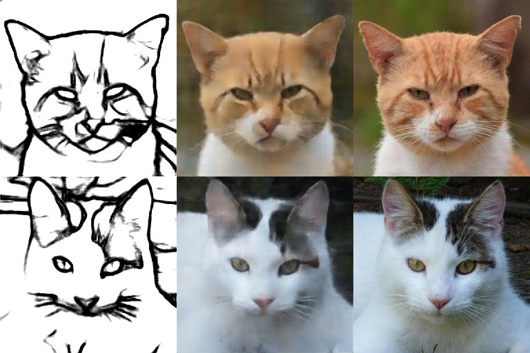
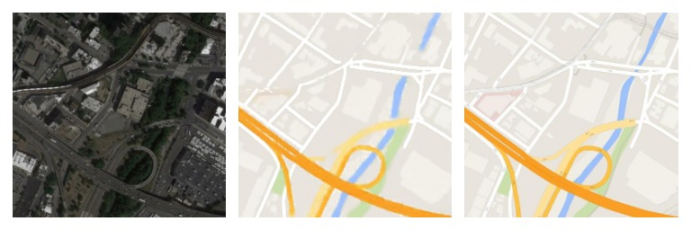

# CatImageGeneration

## Prerequisites
- Python 3
- CPU or NVIDIA GPU + CUDA CuDNN

## Getting Started
### Installation

- Clone this repo
- Create env `conda create --name pix2pix`
- Install requirements `pip install -r requirements.txt`

### train/test
- To download pretrained model and dataset run `bash bin/download.sh`
- Alternative way to download via GD [link](https://drive.google.com/file/d/11tABEiTAhtg6_LyV8Y_ZxwM7Rpy6LQSf/view?usp=sharing) [link](https://drive.google.com/file/d/1mv4AJ3cqe7IpQkFucyWSWeQnLck529nC/view?usp=sharing)

- Train a model:
`python train.py --train_dir ../data_examples/train/ --device cuda --checkpoint_dir ../models/`
 You can also set lr, max_epochs, l1_coef, checkpoint_freq, and val_dir

- Generate:
`python generate.py --edge_dir .../data_examples/generate/ --device cuda --gen_path PATH_TO_PRETRAINED_MODEL --save_dir ../data_examples/generated_imgs/`

## Results
The model was trained on the edge2cats dataset, edges were obtained by pretrained DexiNed [link](https://github.com/xavysp/DexiNed), cats faces dataset [link](https://www.kaggle.com/andrewmvd/animal-faces).
Also model was trained on the maps dataset [link](https://www.kaggle.com/vikramtiwari/pix2pix-dataset).

|1st col: Input / 2nd col: Generated / 3rd col: Target|
|:---:|
||
||
